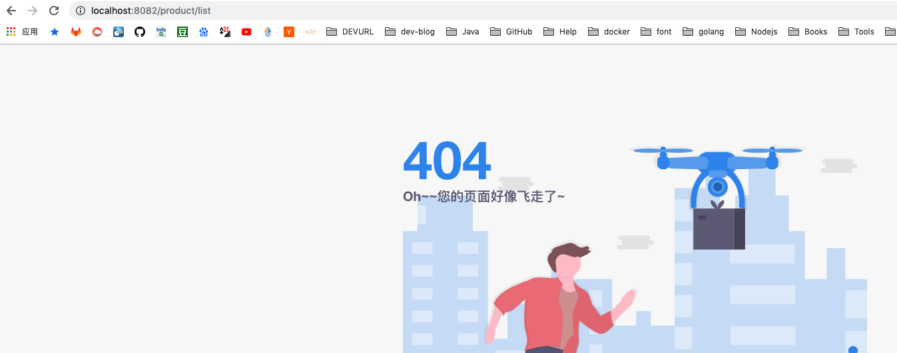
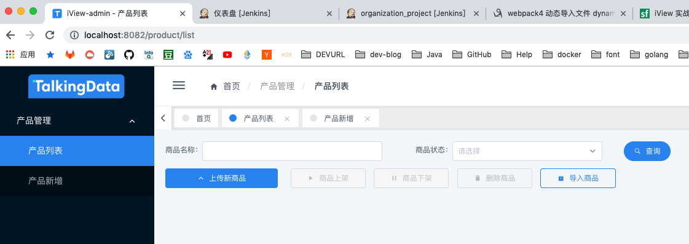
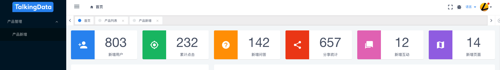
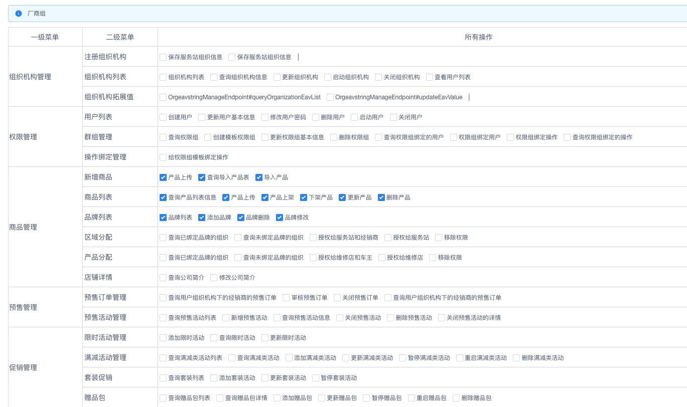

# 关于前后端分离权限的控制（iview-admin实现）

* [关于前后端分离权限的控制（iview-admin实现）](#关于前后端分离权限的控制（iview-admin实现）)
  * [开篇啰嗦几句](#开篇啰嗦几句)
  * [实现思路](#实现思路)
    * [路由方面](#路由方面)
    * [按钮方面](#按钮方面)
    * [数据表格方面](#数据表格方面)
    * [优缺点](#优缺点)
  * [代码实现](#代码实现)
    * [新增权限模块的store](#新增权限模块的store)
    * [用户登陆时初始化拥有的资源操作](#用户登陆时初始化拥有的资源操作)
    * [开始加载菜单](#开始加载菜单)
    * [页面加载的时候自动加载操作](#页面加载的时候自动加载操作)
    * [动态新增有权限的路由](#动态新增有权限的路由)
    * [测试路由和菜单](#测试路由和菜单)
      * [登陆lisi](#登陆lisi)
      * [登陆zhangsan](#登陆zhangsan)
    * [按钮的控制](#按钮的控制)
    * [演示](#演示)
    * [权限编排页面建议](#权限编排页面建议)
  * [权限模块建议](#权限模块建议)


## 开篇啰嗦几句

在传统单体项目中，通常会有一些框架用来管理熟知的权限。如耳濡目染的 `Shiro` 或者 `Spring Security` 。然而，到了现在这个时代，新开始的项目会更多的才用后端微服务 + 前端 `mvvm` 的架构开始书写项目。权限控制方面将变得有些许晦涩。当然，得益于 `Java` 后端的 `Spring` 项目的可插拔式接口以及前端大部分 `SPA` 的架构，权限控制也并没有变得那么的难以实现。相反，在我看来只要找到一个合适的插拔插件的入口，权限也可以做的很简单，跟业务只要少许的耦合即可实现我们熟悉的权限模块。

## 实现思路

### 路由方面

后端提供当前登录用户可访问的所有可访问资源接口信息，前端项目根据当前用户所拥有的接口信息，判断是否拥有菜单权限，如果拥有主要访问权限则加入路由，让用户可以访问其当前的页面。

由于 `iview-admin` 中，路由信息与菜单是同一份资料，所以在加入路由的时候，即可实现菜单的隐藏与现实。

### 按钮方面

按钮通过 [`vue` 自定义指令](https://cn.vuejs.org/v2/guide/custom-directive.html)绑定其特定的操作接口信息（如：产品上传按钮，需要拥有产品上传的信息，才可以继续执行按钮的业务逻辑）。在按钮或者 `a` 标签被渲染的时候，判断是否拥有权限，如若没有，可以隐藏，或者劫持原来绑定的点击事件，使其变成无权限的弹窗提示。

该指令支持 `render` 生成的按钮或者 `a` 标签。

### 数据表格方面

数据的隐藏与否应该不会放在前端做吧...不然就是沙雕网友了。

这方面可以提供思路，在微服务架构中，如若前端项目拥有 `NodeJS` 做数据转换层，那是极好的。如果没有，则需要在微服务路由层做一些细微的改变。即用户无权限的数据列（属性）给他模糊掉，变成 `*` 或者 `—` 输出。这方面与前端无关，那么并不会在这里出现。

### 优缺点

优点：

1. 后端不再关注页面上的事情，基于权限代码让前端自己随心所欲编排
2. 灵活性较高，可以控制页面上所有的元素，可以隐藏弹窗等等喜欢的功能

缺点：

1. 编排路由的时候会显得繁琐，权限代码比较零散，开发完业务页面可能会忘记加上

## 代码实现

公司实现并不能成为开源，所以我重新下载一份 `iview-admin` ，然后加入关键代码，来实现上面所需要的功能。

常规操作：

```shell
npm install
npm run dev
```

正常打开窗口即可进行修改。

接下来就小步前进加入权限的功能。

### 新增权限模块的store

权限提供了一个用户所拥有的所有权限列表以及一个 `getters` 后面会用到。

```js
export default {
  state: {
    // { operatorCode: 'ProductEndpoint#upload', name: '产品上传' }
    operatorList: []
  },
  getters: {
    hasPermission: (state) => (queryOpcode) => {
      if (!state.operatorList || !state.operatorList.length) {
        return false
      }
      return state.operatorList.map(operatInfo => operatInfo.operatorCode).indexOf(queryOpcode) > -1
    }
  },
  mutations: {
    setPermissionList (state, opList) {
      state.operatorList = opList
    }
  }
}
```

在这里我定义简单的后端返回值：一个 `operatorCode` 代表某个操作的代号，一个 `name` 用于分配权限的时候给用户查看。

`operatorCode` 有很多中生成方式，我这里采用 `SpringMVC` 的 `Controller` 名 + `#` + `方法名` 的形式， `Controller` 名用于分割不同资源的资源空间。使用 `Spring` 的生命周期函数，在项目启动的时候扫描，写入数据库，相当于所有的资源。后面的权限模型，以前该怎样就还是怎样，比如用户 —> 角色 —> 资源的模型。然后根据登陆的用户 `ID` 查询，返回给前端。至于中文名字，我们项目搭配 `Swagger` 使用，如果没有使用 `Swagger` 则需要使用自定义开发的注解指定。


注册到 `store` 中：

```js
import Vue from 'vue'
import Vuex from 'vuex'

import user from './module/user'
import app from './module/app'
import permission from './module/permission'

Vue.use(Vuex)

export default new Vuex.Store({
  state: {
    //
  },
  mutations: {
    //
  },
  actions: {
    //
  },
  modules: {
    user,
    app,
    permission
  }
})

```

### 用户登陆时初始化拥有的资源操作

静态操作数据：

```js
// src/mock/data/permission-data.js
export const getPermissionCodeList = (userName) => {
  if (String(userName) === '1') {
    return [{ operatorCode: 'ProductManageEndpoint#createProduct', name: '产品上传' },
      { operatorCode: 'ProductManageEndpoint#putawayProduct', name: '产品上架' },
      { operatorCode: 'ProductManageEndpoint#delistProduct', name: '产品下架' }]
  } else {
    return [{ operatorCode: 'ProductManageEndpoint#createProduct', name: '产品上传' },
      { operatorCode: 'ProductManageEndpoint#delistProduct', name: '产品下架' },
      { operatorCode: 'ProductManageEndpoint#deleteByUuid', name: '产品删除' }]
  }
}

```

登陆操作：

```js
// src/view/login/login.vue
...
handleSubmit ({ userName, password }) {
    this.handleLogin({ userName, password }).then(res => {
        this.getUserInfo().then(res => {
            // 用户登陆成功时候加入操作Code
            this.$store.commit('setPermissionList', getPermissionCodeList(userName))
            this.$router.push({
                name: this.$config.homeName
            })
        })
    })
}
```

加入用户列表的信息，不然不能登录，因为作者默认只放了两个，当然生产项目肯定不管这里啦~~

```js
// src/mock/login.js
const USER_MAP = {
  super_admin: {
    name: 'super_admin',
    user_id: '1',
    access: ['super_admin', 'admin'],
    token: 'super_admin',
    avator: 'https://file.iviewui.com/dist/a0e88e83800f138b94d2414621bd9704.png'
  },
  admin: {
    name: 'admin',
    user_id: '2',
    access: ['admin'],
    token: 'admin',
    avator: 'https://avatars0.githubusercontent.com/u/20942571?s=460&v=4'
  },
  zhangsan: {
    name: 'zhangsan',
    user_id: '3',
    access: ['super_admin', 'admin'],
    token: 'zhangsan',
    avator: 'https://avatars0.githubusercontent.com/u/20942571?s=460&v=4'
  },
  lisi: {
    name: 'lisi',
    user_id: '4',
    access: ['super_admin', 'admin'],
    token: 'lisi',
    avator: 'https://avatars0.githubusercontent.com/u/20942571?s=460&v=4'
  }
}
...
```

加入权限数据：

```js
// src/mock/data/permission-data.js
export const getPermissionCodeList = (userName) => {
  if (userName === 'zhangsan') {
    return [{ operatorCode: 'ProductManageEndpoint#list', name: '产品列表' },
      { operatorCode: 'ProductManageEndpoint#createProduct', name: '产品上传' },
      { operatorCode: 'ProductManageEndpoint#putawayProduct', name: '产品上架' },
      { operatorCode: 'ProductManageEndpoint#delistProduct', name: '产品下架' }]
  } else {
    return [{ operatorCode: 'ProductManageEndpoint#createProduct', name: '产品上传' },
      { operatorCode: 'ProductManageEndpoint#delistProduct', name: '产品下架' },
      { operatorCode: 'ProductManageEndpoint#deleteByUuid', name: '产品删除' }]
  }
}

```


### 开始加载菜单

刚开始我们先设立一个口进入，由于项目的 `menuList` 挂载在 `store` 的 `app.js` 里面，所以我们需要在这里动刀。

这里修改造成两个事情：1. 清掉项目原来的 `router` 的菜单，但是还可以访问（因为内存加载了）；2. 我加入了需要权限管理的菜单，但是还不能访问，因为路由还没有。

```js
// src/store/module/app.js
...
getters: {
    menuList: (state, getters, rootState) => {
      const allMenus = []
      const menuWithPermission = getMenuWithPermissionByRouter(routersWithPermission, rootState.permission.operatorList)
      allMenus.push(...menuWithPermission)
      return allMenus
    }
}
...
```

那么这里用到一个函数 `getMenuWithPermissionByRouter`，我决定放在 `util.js` 即可

```js
// src/libs/util.js
...
export const getMenuWithPermissionByRouter = (routerWithPermissionList, userOperatorList) => {
  return []
}
```

OK，运行项目。很好，没有出现错误，继续前行。


我的需求是这样的，当一个路由，在 `meta` 里面的 `requireCode` 用户拥有第一项操作权限的时候，是可以进入的，也就是菜单需要加载出来。

```js
export default [
  {
    path: '/product',
    name: 'product',
    component: Main,
    meta: {
      hideInBread: true
    },
    children: [
      {
        path: 'list',
        name: 'list',
        meta: {
          title: 'product-list',
          requireCode: ['ProductManageEndpoint#list', 'ProductManageEndpoint#createProduct', 'ProductManageEndpoint#putawayProduct', 'ProductManageEndpoint#delistProduct', 'ProductManageEndpoint#deleteByUuid']
        },
        component: () => import('@/view/product/product-list.vue')
      },
      {
        path: 'add',
        name: 'add',
        meta: {
          title: 'product-add',
          requireCode: ['ProductManageEndpoint#createProduct']
        },
        component: () => import('@/view/product/product-form.vue')
      }
    ]
  }
]
```


当这个页面需要同时满足两个要求的资源操作的时候，第一项使用数组装载。即：

```js
requireCode: [['ProductManageEndpoint#list', 'ProductManageEndpoint#createProduct'], 'ProductManageEndpoint#putawayProduct', 'ProductManageEndpoint#delistProduct', 'ProductManageEndpoint#deleteByUuid']
```

那么这个页面需要同时满足前面两个的时候，才能加载出来。


那么开始编写 `getMenuWithPermissionByRouter` 函数。呃，怎么说呢，先把 `Aresn` 的代码拷过来改改满足我上面的需求即可：

```js
/**
 * 根据需要控制菜单的路由，获取菜单列表
 * @param routerWithPermissionList 需要权限管理的路由
 * @param userOperatorList 用户拥有的所有操作
 * @returns {Array}
 */
export const getMenuWithPermissionByRouter = (routerWithPermissionList, userOperatorList) => {
  // debugger
  let res = []
  const allOpCodeArr = userOperatorList.map(opCodeObj => opCodeObj.operatorCode)
  forEach(routerWithPermissionList, item => {
    if (!item.meta || (item.meta && !item.meta.hideInMenu)) {
      let obj = {
        icon: (item.meta && item.meta.icon) || '',
        name: item.name,
        meta: item.meta
      }
      if ((hasChild(item) || (item.meta && item.meta.showAlways))) {
        obj.children = getMenuWithPermissionByRouter(item.children, userOperatorList)
      }
      if (hasThisMenuPermission(item, allOpCodeArr) || hasChild(item)) res.push(obj)
    }
  })
  return res
}

const hasThisMenuPermission = (routerInfo, allOpCodeArr) => {
  if (routerInfo.meta && routerInfo.meta.requireCode && routerInfo.meta.requireCode.length) {
    const requireCode = routerInfo.meta.requireCode[0]
    if (Array.isArray(requireCode)) {
      let hasPermission = true
      for (let i = 0; i < requireCode.length; i++) {
        hasPermission = hasPermission && allOpCodeArr.indexOf(requireCode[i]) > -1
      }
      return hasPermission
    } else {
      return allOpCodeArr.indexOf(requireCode) > -1
    }
  } else return false
}

```

OK，如图所示，已经把菜单加载出来了。但是现在出现一个问题，就是刷新页面的时候，什么都没了。因为刷新页面的时候，内存中的 `store` 被置空了。


### 页面加载的时候自动加载操作

```js
// src/view/single-page/home/home.vue
...
mounted () {
    // 需要在这里加载权限信息
    const userName = this.$store.state.user.userName
    this.$store.commit('setPermissionList', getPermissionCodeList(userName))
}
...
```

可喜可贺，刷新的时候，菜单已经出来了。但是有个报错，报 `sideMenu` 的 `undefined` 异常。是由于刚开始刷新页面的时候，菜单还没有出来，而代码写死了读第0个元素，菜单是空数组，所以理所当然导致了异常。

```html
// src/components/main/components/side-menu/side-menu.vue 第 20 行，去掉最后属性的或者即可
<a @click="handleSelect(getNameOrHref(item, true))" class="drop-menu-a" :style="{textAlign: 'center'}"><common-icon :size="rootIconSize" :color="textColor" :type="item.icon"/></a>
```

OK，我感觉最难的菜单搞定了。接下来要搞定路由。

### 动态新增有权限的路由

有了前面的铺垫，我感觉路由要好做很多了。

动态路由有一个调用的函数是：

```js
router.addRoutes(routes: Array<RouteConfig>)
```

那么我们需要做的只是，获取有权限的路由，然后加入到 `Vue` 中。

但是这段代码有点问题就是每次进入都会调用一次= =

```js
// src/view/single-page/home/home.vue
mounted () {
    // 需要在这里加载权限信息
    const userName = this.$store.state.user.userName
    this.$store.commit('setPermissionList', getPermissionCodeList(userName))
    const routers = getRouterWithPermission(routersWithPermission, this.$store.state.permission.operatorList)
    const originRouteNames = this.$router.options.routes.map(r => r.name)
    // 需要解决重复加入问题
    if (routers && routers.length && originRouteNames.indexOf(routers[0].name) < 0) {
        this.$router.addRoutes(routers)
    }
}
```

好了，菜单有了，路由有了，点击测试能否进入。

然后被作者的路由拦截到了-,-

```js
// src/router/index.js
const turnTo = (to, access, next) => {
  next() // 直接过。
}
```

### 测试路由和菜单

分别登陆 `zhangsan` 和 `lisi` 从上面的测试权限数据可以看到，`lisi` 是进入不了产品列表的。

#### 登陆lisi


强行进入：



OK，正确了，如果没有权限，肯定就没有页面嘛，直接404.

#### 登陆zhangsan



### 按钮的控制

页面的跳转搞定了，接下来就要考虑按钮的问题了。那么上面设置的 `Vuex` 的 `hasPermission` 在这里派上用场。关于按钮的绑定，思路来源于 `Vue` 的自定义指令，只需要在主页面注册自定义指令，每次页面加载的时候，加载到指定指令的组件，开始读取这个组件的 `operaCode` 是否在当前登陆的用户中，如果存在，则继续执行，如果不存在，则拿到了节点的 `Vnode` 开始设置我们想要的东西，比如锁定按钮啊，劫持点击事件弹出提示，或者隐藏都可以。

```js
// src/main.js
/**
 * 注册权限控制指令
 */
Vue.directive('opcode', {
  bind: function (el, opcode, vnode, oldVNode) {
    const requireOpCode = opcode.value
    // 如果用户没有这个操作Code的权限，那么劫持click事件，赋予弹出无权限弹窗的事件
    console.log(requireOpCode);
    if (vnode.componentInstance === undefined || vnode.componentInstance === null) {
      if (!vnode.context.$store.getters.hasPermission(requireOpCode)) {
        vnode.data.on.click.fns = function () {
          Modal.warning({
            title: '无权限',
            content: '很抱歉，您没有这项操作的权限'
          })
        }
      }
    } else {
      if (!vnode.componentInstance.$store.getters.hasPermission(requireOpCode)) {
        vnode.componentInstance.$off('click')
        vnode.componentInstance.$on('click', function () {
          Modal.warning({
            title: '无权限',
            content: '很抱歉，您没有这项操作的权限'
          })
        })
      }
    }
  }
})
```

常规按钮使用：

```html
<!-- src/view/product/components/toolbars.vue -->
<Button v-opcode="'ProductManageEndpoint#createProduct'" type="primary" class="btn" icon="ios-arrow-up" @click="$router.push('/product/add')">上传新商品</Button>
```

`Render` 函数中使用：

```js
// src/view/product/product-list.vue
prodColumns: [
        {
          title: '商品名称',
          key: 'pname',
          align: 'center',
          width: 300
        },
        {
          title: '操作',
          key: 'operator',
          align: 'center',
          render: (h, params) => {
            return h('a', {
              attrs: {
                href: 'javascript:;'
              },
              on: {
                click: () => {
                  this.handleEditProduct(params.row)
                }
              },
              // 在这里注册自定义指令
              directives: [
                {
                  name: 'opcode',
                  value: 'ProductManageEndpoint#updateByUuid'
                }
              ]
            }, '编辑')
          }
        }
      ],
```

这种方式即使分页，改变表格数据，也可以被主页面上的判断监听到。


PS：在这里就可以看到了按钮的编排的问题，即我们新增产品的页面接口，是在填写完 `Form` 表单的时候才开始请求的，但是我们需要在两个地方做设置，一个是跳转页面（路由+菜单），一个是新增产品的按钮，即需要把这个权限拦截提前到进入页面之前。这方面现在确实想不到更好的解决办法了。

### 演示

回顾一下权限设置数据：

```js
export const getPermissionCodeList = (userName) => {
  if (userName === 'zhangsan') {
    return [{ operatorCode: 'ProductManageEndpoint#list', name: '产品列表' },
      { operatorCode: 'ProductManageEndpoint#createProduct', name: '产品上传' },
      { operatorCode: 'ProductManageEndpoint#putawayProduct', name: '产品上架' },
      { operatorCode: 'ProductManageEndpoint#delistProduct', name: '产品下架' }]
  } else {
    return [{ operatorCode: 'ProductManageEndpoint#createProduct', name: '产品上传' },
      { operatorCode: 'ProductManageEndpoint#delistProduct', name: '产品下架' },
      { operatorCode: 'ProductManageEndpoint#deleteByUuid', name: '产品删除' }]
  }
}
```

我们知道，用户名为 `zhangsan` 是没有删除产品权限以及编辑产品的，但是前面的都有。而 `lisi` 用户，没有产品列表功能，所以列表都不可以进去。

`zhangsan` 用户界面：


`lisi` 用户界面：



### 权限编排页面建议

我们知道，经典权限模型是用户、角色、资源的编排。那么我们可以设置一系列的角色，当然记得给自己预留一个流氓角色可以读取所有资源和角色的，利于管理。每个角色可以绑定不同的资源，也可以绑定不同的用户。这样用户一旦登陆，即可读取所有角色中的所有资源操作（记得去重）。

我们公司的绑定界面，通过读取用户所拥有的所有资源，再把 `router` 中绑定的读取出来（当然过滤掉当前绑定用户无权限的），然后通过加载勾选，最后发送请求给服务器做修改。这样设置可以无限极下限，只要赋予用户授权的权限，用户即可一直创建然后绑定他想绑定的。




## 权限模块建议

当前所做的都是前端需要做的工作，后端也需要配合完成接口的调用，即使前端做了设置，但是有些用户可以绕过前端，这时候所有的权限操作就需要后端来拦截了。


